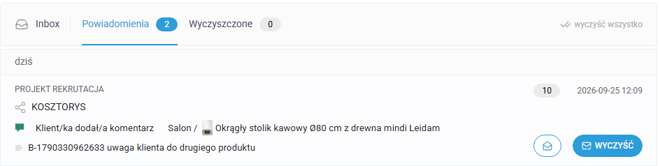
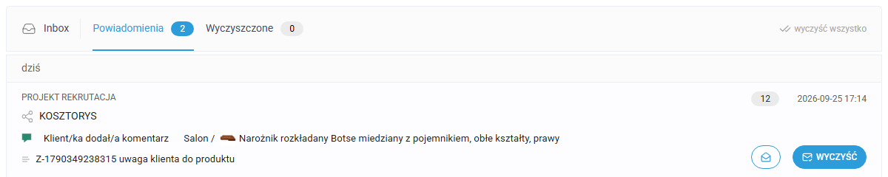
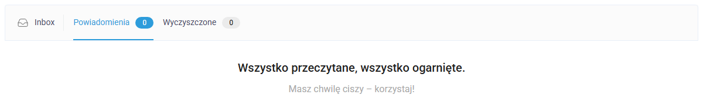

# KIS List — testy systemu powiadomień o komentarzach

Zadanie rekrutacyjne na stanowisko testera. Repozytorium zawiera raport
z testów manualnych (Część 1) oraz test automatyczny w Playwright + TypeScript,
odtwarzający znaleziony błąd (Część 2).

**Autor:** Szymon Podsadny
**Testy wykonane:** 23–25.09.2026
**Testowana aplikacja:** https://kislist.com (konto testowe udostępnione przez zespół KIS List)

---

## Najważniejsze w skrócie

Zgłoszenie brzmiało: *„członkowie zespołu nie zawsze otrzymują powiadomienia
o komentarzach na listach; nie pamiętam, których sytuacji dotyczy problem"*.

Po dwóch dniach pomiarów na czterech kontach odpowiedź jest taka:

> **Powiadomienia trafiają wyłącznie do właściciela konta i wyłącznie
> o komentarzach klienta. Pozostali członkowie zespołu nie dostają ich nigdy —
> w żadnym z trzech scenariuszy opisanych w zadaniu.**

Wszystkie trzy wymagania produktowe z treści zadania są naruszone:

| # | Wymaganie | Kto powinien dostać | Kto faktycznie dostaje | Wynik |
|---|---|---|---|---|
| 1 | klient komentuje **propozycję** | wszyscy członkowie zespołu powiązani z listą | tylko właściciel | 🔴 |
| 2 | klient komentuje **udostępnioną listę** | wszyscy członkowie zespołu powiązani z listą | tylko właściciel | 🔴 |
| 3 | członek zespołu komentuje **element listy** | pozostali członkowie zespołu | **nikt** | 🔴 |

Dlaczego zgłaszający napisał „nie zawsze": jest właścicielem konta i jako jedyny
cokolwiek dostaje. Z jego perspektywy system działa, a zespół zgłasza mu, że do
nich nic nie dociera. **Wynik nie zależy od sytuacji, tylko od tego, kto pyta** —
i dlatego nie da się tego odtworzyć, próbując różnych scenariuszy na własnym koncie.

> **Uwaga o rzetelności raportu.** Jedno ze znalezisk wycofałem w trakcie pracy,
> po ponownym sprawdzeniu. Opisuję to otwarcie w sekcji 9, razem z tym, co poszło
> nie tak w mojej metodzie. Wolę raport, który pokazuje korektę, niż taki, który
> brzmi spójnie, ale w jednym miejscu mija się z prawdą.

---

## 1. Środowisko i założenia

| Element | Wartość |
|---|---|
| Aplikacja | https://kislist.com, wersja produkcyjna |
| Okres testów | 23–25.09.2026 |
| Przeglądarka | Chrome (stabilny), cztery osobne profile + okno incognito dla klienta |
| System | Windows 11 |
| Dostęp | konto testowe z zespołem, projekt „PROJEKT REKRUTACJA", lista „KOSZTORYS" (13 produktów w 3 sekcjach) |

### Skład zespołu użyty w testach

| Konto | Rola w KIS List | Stan konta | Powiązanie z listą |
|---|---|---|---|
| właściciel (odpowiednik zgłaszającego) | administrator | — | tak |
| członek zespołu nr 1 | członek zespołu | potwierdzony | tak |
| członek zespołu nr 2 | członek zespołu | potwierdzony | tak |
| członek zespołu nr 3 | członek zespołu | potwierdzony | tak |
| klient | brak konta — dostęp przez publiczny link oraz przez propozycję wysłaną mailem | — | — |

Wszyscy trzej członkowie zespołu widzieli projekt na swojej liście projektów.
Aplikacja stwierdza wprost na ekranie zespołu: *„Członkowie zespołu mogą
udostępniać i edytować wszystkie listy i ulubione"*. Warunek „powiązani z listą"
był więc spełniony przed każdym pomiarem.

### Przyjęte założenia

1. **„Powiązany z listą"** rozumiem jako: użytkownik jest w zespole i widzi
   projekt zawierający tę listę. Aplikacja nie udostępnia przypisania
   do pojedynczej listy — to pytanie do product ownera (sekcja 10).
2. **Kanał powiadomień** to panel w aplikacji (dzwonek) **oraz** e-mail.
   Sprawdziłem oba, bo zgłoszenie nie precyzuje którego dotyczy.
3. **Panel nie odświeża się sam** — każdy odczyt robiłem po przeładowaniu strony.
   Bez tego wynik byłby fałszywie negatywny.
4. **Mail chodzi raz na godzinę** — to wniosek z **moich pomiarów**: obie
   wiadomości wyszły o pełnych godzinach (20:00 i 23:00). Dokumentacja producenta
   mówi o godzinnym sprawdzaniu odpowiedzi w propozycjach i zapalaniu kropki
   na dzwonku, co jest zbieżne, ale nie jest tym samym zdaniem. Dlatego przy pomiarach
   mailowych czekałem do najbliższej pełnej godziny, a **test automatyczny
   celowo nie opiera się na mailu** — asercja idzie na panel, który reaguje
   w ciągu kilku sekund.
5. Każdy komentarz testowy miał **znacznik w treści** mówiący, kto go napisał
   i z jakiego okna. Bez tego przy czterech kontach nie da się rzetelnie ustalić
   autora — i raz o mało nie zgłosiłem błędu, który nim nie był (sekcja 9).

---

## 2. Plan testów

Punkt wyjścia: skoro zgłaszający zauważył problem, to najpewniej sam
powiadomienia dostaje — nie dostają ich inni. To zawęziło pole poszukiwań
i wyznaczyło kierunek: **zmieniać jedną zmienną naraz i sprawdzać wszystkie
konta przy każdym pomiarze**.

### Wymiary matrycy

| Wymiar | Wartości |
|---|---|
| Autor komentarza | klient / członek zespołu / właściciel |
| Miejsce komentarza | propozycja / udostępniona lista / element listy (zakładka prywatna) |
| Odbiorca | właściciel / członek powiązany z listą / sam autor / klient |
| Kanał | panel w aplikacji / e-mail |
| Odświeżenie | bez reloadu / po reloadzie |

### Scenariusze pozytywne — powiadomienie **ma** się pojawić

| ID | Kroki | Oczekiwany rezultat | Wynik |
|---|---|---|---|
| POZ-01 | Klient komentuje **propozycję** wysłaną mailem | Powiadomienie u wszystkich członków zespołu | 🔴 **NIE** — tylko właściciel |
| POZ-02 | Klient komentuje **udostępnioną listę** (publiczny link) | Powiadomienie u wszystkich członków zespołu | 🔴 **NIE** — tylko właściciel |
| POZ-03 | Członek zespołu komentuje element listy | Powiadomienie u pozostałych członków | 🔴 **NIE** — u nikogo |
| POZ-04 | Właściciel komentuje element listy | Powiadomienie u pozostałych członków | 🔴 **NIE** — u nikogo |
| POZ-05 | Kilka komentarzy klienta do różnych produktów tej samej listy | Odbiorca ma dostęp do każdego z nich | 🟡 **CZĘŚCIOWO** — widoczny tylko najnowszy, reszta po kliknięciu w grupę |
| POZ-06 | Komentarz klienta → wiadomość e-mail | Mail w skrzynce odbiorczej, z poprawną liczbą komentarzy | 🔴 **NIE** — spam + zaniżona liczba |

### Scenariusze negatywne — powiadomienie **nie ma** się pojawić

| ID | Kroki | Oczekiwany rezultat | Wynik |
|---|---|---|---|
| NEG-01 | Autor komentuje element listy | Autor **nie** dostaje powiadomienia o sobie | ✅ **POPRAWNIE** |
| NEG-03 | Członek zespołu pisze komentarz w zakładce „🔒 Prywatne" | Klient **nie widzi** treści i nie dostaje powiadomienia | ✅ **POPRAWNIE** |

Scenariusze negatywne są tu tak samo ważne jak pozytywne: **NEG-03 sprawdza
najbardziej ryzykowny obszar, czyli wyciek komunikacji wewnętrznej do klienta
zewnętrznego.** Wynik jest poprawny i uważam, że trzeba to napisać wprost —
raport ma pokazywać, co sprawdzono, a nie tylko co jest zepsute.

Scenariusze zaplanowane, ale niewykonane, wymieniam w sekcji 9 (Ograniczenia).

---

## 3. Wyniki — błędy znalezione

Kolejność według wagi.

---

### 🔴 A1 — Komentarz klienta powiadamia wyłącznie właściciela listy

**Narusza wymaganie nr 1 i nr 2 z treści zadania.** To jest błąd odtwarzany
przez test automatyczny z Części 2.

> „gdy klient komentuje propozycję / udostępnioną listę, powiadomienie powinni
> otrzymać wszyscy członkowie zespołu powiązani z listą"

**Kroki odtworzenia**

1. Zaloguj się jako właściciel listy.
2. Dodaj do zespołu co najmniej jednego członka (rola: członek zespołu)
   i upewnij się, że widzi projekt z listą.
3. Udostępnij listę publicznym linkiem *(albo wyślij klientowi propozycję —
   sprawdziłem obie ścieżki, wynik identyczny)*.
4. W oknie incognito otwórz link jako anonimowy klient i dodaj komentarz
   do dowolnego produktu.
5. Odśwież panel powiadomień u właściciela.
6. Odśwież panel powiadomień u pozostałych członków zespołu.

**Oczekiwany rezultat**

Powiadomienie widoczne u wszystkich członków zespołu powiązanych z listą.

**Rzeczywisty rezultat**

| Konto | Panel po komentarzu klienta |
|---|---|
| właściciel | ✅ „Klient/ka dodał/a komentarz", wpis pojawia się, licznik grupy rośnie |
| członek zespołu nr 1 | ❌ Powiadomienia **0**, „Wszystko przeczytane, wszystko ogarnięte" |
| członek zespołu nr 2 | ❌ Powiadomienia **0** |
| członek zespołu nr 3 | ❌ Powiadomienia **0** |

Potwierdzone na **trzech niezależnych kontach, w trzech osobnych profilach
przeglądarki**, na **dwóch niezależnych ścieżkach klienta** (propozycja wysłana
mailem oraz udostępniona lista), w dwóch osobnych sesjach pomiarowych: 25.09
przed południem (komentarz do „Fotela obrotowego Solla") oraz 25.09 po południu
(komentarz do „Narożnika rozkładanego Botse"). Tabela powyżej podsumowuje obie.

**Wykluczone alternatywne wyjaśnienia**

Zanim uznałem to za błąd, sprawdziłem trzy rzeczy, które mogłyby to tłumaczyć:

| Hipoteza | Sprawdzenie | Wynik |
|---|---|---|
| Powiadomienia członków trafiają gdzie indziej | Porównanie `/inbox` z panelem przy liście | To ten sam widok, nie ma drugiej skrzynki |
| Członkowie mają powiadomienia wyłączone | Przegląd wszystkich ustawień aplikacji | W aplikacji **nie ma żadnej opcji** dotyczącej powiadomień |
| Członkowie nie mają dostępu do listy | Ekran zespołu + widok listy z ich konta | Mają dostęp, konta **potwierdzone**, przy produktach widzą liczniki komentarzy |

Ostatni punkt jest rozstrzygający: członek zespołu **widzi na dymku przy
produkcie, że są tam komentarze**, a mimo to w panelu powiadomień ma pustkę.
Dane do niego docierają — powiadomienia nie.

**Wpływ na użytkownika**

Listę prowadzi cały zespół, ale komentarz klienta widzi wyłącznie właściciel
konta. Jeśli akurat nie pracuje, jest na urlopie albo nie zagląda do panelu,
uwaga klienta nie dociera do nikogo, kto mógłby na nią zareagować. Dla produktu,
którego sensem jest wspólna praca zespołu nad listą z klientem, to podważa
podstawową funkcję.

**Priorytet (ocena własna):** wysoki.

---

### 🔴 A2 — Komentarz członka zespołu nie generuje powiadomienia dla nikogo

**Narusza wymaganie nr 3 z treści zadania.**

> „gdy członek zespołu komentuje element listy, powiadomienie powinni otrzymać
> pozostali członkowie zespołu powiązani z listą"

**Kroki odtworzenia**

1. Zespół: właściciel + co najmniej dwóch członków, wszyscy z dostępem do listy.
2. Zaloguj się jako **członek zespołu** (nie właściciel).
3. Otwórz dymek komentarzy przy dowolnym produkcie.
4. Przełącz się na zakładkę **🔒 Prywatne**.
5. Dodaj komentarz i wyślij.
6. Odśwież panel powiadomień u właściciela i u pozostałych członków.

**Oczekiwany rezultat**

Powiadomienie u wszystkich członków zespołu powiązanych z listą poza autorem.

**Rzeczywisty rezultat**

| Konto | Rola | Panel powiadomień |
|---|---|---|
| właściciel | administrator | ❌ bez zmian |
| członek zespołu nr 2 | członek zespołu | ❌ Powiadomienia **0** |
| członek zespołu nr 3 | członek zespołu | ❌ Powiadomienia **0** |
| autorka komentarza | członek zespołu | ✅ poprawnie brak — autor nie jest powiadamiany |

Komentarz **zapisał się poprawnie** i jest widoczny w zakładce „Prywatne"
z właściwym podpisem autora. Problem dotyczy wyłącznie powiadomień.
Panel właściciela sprawdziłem **dwukrotnie, w odstępie kilku minut** —
to nie jest opóźnienie.

**Wpływ na użytkownika**

Cała komunikacja wewnętrzna zespołu jest niema. Członkowie zespołu mogą pisać
do siebie komentarze, o których nikt się nie dowie, dopóki przypadkiem nie
otworzy dymka przy konkretnym produkcie.

**Priorytet (ocena własna):** wysoki.

---

### 🔴 B2 — Kanał e-mail: powiadomienia trafiają do spamu i zaniżają liczbę komentarzy

#### B2a — maile lądują w folderze Spam

**Kroki odtworzenia**

1. Konto właściciela z adresem w domenie **o2.pl**.
2. Klient dodaje komentarz do produktu na udostępnionej liście.
3. Odczekać do najbliższej pełnej godziny.
4. Sprawdzić skrzynkę odbiorczą, a następnie folder **Spam**.

**Oczekiwany rezultat:** wiadomość „Powiadomienia w KIS List: KOSZTORYS"
w skrzynce odbiorczej.

**Rzeczywisty rezultat:** wiadomość trafia do folderu **Spam**.
Komunikat o2.pl: *„Jest bardzo podobna do innych niechcianych wiadomości."*

**Wpływ:** o2.pl i wp.pl to w Polsce bardzo popularne skrzynki, a grupą docelową
produktu są polskie biura projektowe. Użytkownik, dla którego mail jest głównym
kanałem informowania, **nie widzi powiadomień w ogóle**.

**Poszlaka, nie ustalenie:** nadawcą jest `app@kislist.eu`, podczas gdy aplikacja
stoi na `kislist.com`. Rozbieżność domeny nadawcy z domeną produktu bywa jednym
z czynników obniżających reputację nadawcy. Weryfikacja wymaga sprawdzenia
rekordów SPF, DKIM i DMARC dla `kislist.eu`, do czego nie miałem dostępu.

**Priorytet (ocena własna):** wysoki — dotyczy dostarczalności podstawowego
kanału komunikacji na jednej z najpopularniejszych polskich domen pocztowych.

#### B2b — liczba komentarzy zapowiadanych mailem nie zgadza się z rzeczywistą

| Godzina | Zdarzenie | Mail |
|---|---|---|
| 19:24 | komentarz klienta — Ekspres do kawy SMEG | ✅ **20:00**, treść: „1 Nowe komentarze" |
| 21:53 | komentarz klienta — Dywan shaggy | ❓ **brak maila o 22:00** |
| 22:00 | komentarz klienta — Miska WC | ✅ **23:00**, treść: „1 Nowe komentarze" |

**Bilans: 3 komentarze klienta → 2 maile → każdy zapowiada 1 komentarz.**
Co najmniej jeden komentarz nie został zapowiedziany.

**Przyczyny nie ustaliłem.** Możliwe scenariusze: zadanie cykliczne o 22:00
nie uruchomiło się; uruchomiło się, ale pominęło komentarz z 21:53; albo mail
o 23:00 objął oba komentarze, lecz policzył jeden. Rozróżnienie wymaga wglądu
w logi zadania cyklicznego, do których tester nie ma dostępu. Odnotowuję
z danymi pomiarowymi, do weryfikacji po stronie zespołu.

#### B2c — błąd językowy w treści maila

Rzeczywisty rezultat: „✨ **1 Nowe komentarze** do udostępnionej listy: KOSZTORYS".
Oczekiwany: odmiana zgodna z liczebnikiem — „1 nowy komentarz", „2 nowe
komentarze", „5 nowych komentarzy". Liczba mnoga jest zakodowana na sztywno,
bez obsługi polskich form liczebnikowych.

**Priorytet:** niski (kosmetyczny), ale łatwy do naprawienia.

---

### 🟡 C1 — Licznik powiadomień podaje liczbę grup, a nie zdarzeń; starsze wpisy są ukryte bez wskazówki

Dotyczy jedynego odbiorcy, który w ogóle powiadomienia dostaje — właściciela.

**Kroki odtworzenia**

1. Jako anonimowy klient dodaj kilka komentarzy do **różnych produktów** tej
   samej udostępnionej listy.
2. W oknie właściciela odśwież stronę i otwórz panel powiadomień.
3. Odczytaj licznik przy zakładce „Powiadomienia" i liczbę widocznych wpisów.
4. Kliknij w wpis grupy.

**Oczekiwany rezultat**

Licznik odpowiada liczbie nieprzeczytanych powiadomień, a z panelu widać,
że wpis zawiera więcej zdarzeń i da się je rozwinąć.

**Rzeczywisty rezultat** *(pomiar 25.09, godz. 17:20)*

| Pomiar | Wartość |
|---|---|
| Licznik zakładki „Powiadomienia" | **2** |
| Widocznych wpisów przed kliknięciem | **2** |
| Plakietka grupy „udostępniona lista" | **12** |
| Zdarzeń łącznie po rozwinięciu | **13** (12 z listy + 1 z propozycji) |
| Ikona rozwijania (strzałka, chevron) | **brak** |
| Atrybut `aria-expanded` | **brak** |
| Podpowiedź `title` | **brak** |

Powiadomienia są grupowane per lista i per źródło (udostępniona lista
i propozycja osobno). W zwiniętej grupie widać **wyłącznie najnowsze zdarzenie**.
Grupa **daje się rozwinąć kliknięciem** — po kliknięciu liczba widocznych
zdarzeń rośnie z 2 do 13 — ale **nic w interfejsie tego nie sugeruje**: nie ma strzałki,
nie ma atrybutu dostępnościowego, nie ma podpowiedzi. Powtórne kliknięcie zwija.



*Zrzut z wcześniejszego pomiaru tego samego dnia, godz. 12:09. Licznik zakładki
pokazuje **2**, plakietka grupy **10**, a widoczny jest **jeden** komentarz —
najnowszy. Pozostałe dziewięć zdarzeń z tej grupy jest dostępne dopiero
po kliknięciu w ten wpis. Do godz. 17:20 plakietka grupy urosła do 12,
przy niezmienionym liczniku zakładki.*

**Wpływ na użytkownika**

Użytkownik widzący „2" nie ma powodu przypuszczać, że czeka na niego trzynaście
zdarzeń, ani że w ten wpis można kliknąć. Przy aktywnym kliencie łatwo
przeoczyć wcześniejsze uwagi — nie dlatego, że przepadły, tylko dlatego,
że nic nie mówi, gdzie ich szukać.

**Priorytet (ocena własna):** średni. To problem czytelności i dostępności,
nie utraty danych.

**Sugestia naprawy**

Licznik powinien odpowiadać liczbie nieprzeczytanych zdarzeń. Grupa powinna mieć
widoczny znacznik rozwijania oraz `aria-expanded` dla czytników ekranu.

> **To znalezisko było pierwotnie zgłoszone jako poważniejsze** — jako gubienie
> starszych powiadomień. Skorygowałem je po ponownym sprawdzeniu; opis korekty
> jest w sekcji 9.

---

## 4. Scenariusze zakończone poprawnie

### ✅ NEG-01 — autor nie dostaje powiadomienia o własnym komentarzu

Po dodaniu komentarza panel autora pozostał bez zmian — ten sam wpis, ten sam
licznik. **Filtr wykluczający autora działa.**

Znaczenie dla diagnozy: gdyby autor dostawał powiadomienia o sobie, zgłoszenie
można by tłumaczyć zagubieniem się we własnych wpisach. Nie można — ten
mechanizm działa poprawnie, a przyczyna leży gdzie indziej.

### ✅ NEG-03 — komentarz prywatny nie wycieka do klienta

Po dodaniu komentarza w zakładce „🔒 Prywatne" anonimowy klient odświeżył
widok udostępnionej listy i przy tym samym produkcie nadal widział wyłącznie
swój własny komentarz. Wpis z zakładki prywatnej **niewidoczny**.

**Izolacja komunikacji wewnętrznej od widoku klienta działa szczelnie.**
To najbardziej ryzykowny obszar, jaki sprawdzałem — dlatego opisuję go mimo
pozytywnego wyniku.

---

## 5. Obserwacje poza zakresem zadania

Poniższe znaleziska nie dotyczą powiadomień. Trafiły do raportu, bo pojawiły się
przy okazji testów, a dwa z nich dotyczą dostępu do danych. **Wyraźnie oddzielam
je od zakresu zadania.**

| ID | Obserwacja | Priorytet |
|---|---|---|
| Z1 | Komunikat przy weryfikacji telefonu ujawnia, że numer jest powiązany z kontem, i pokazuje zamaskowany adres e-mail („Ten numer jest już połączony z kontem `s.******@***pl`"). Ułatwia ustalenie, że dana osoba ma konto, i ukierunkowany phishing. | niski/średni |
| Z2 | Licznik pozycji w nagłówku sekcji zlicza co innego u właściciela (produkty), a co innego u klienta (wszystkie pozycje z notatkami i wizualizacjami): sekcja „Salon" — 5 u właściciela, 7 u klienta, przy identycznej sumie złotówkowej. | niski |
| Z3 | „Zapamiętaj mnie" nie zmienia zachowania — użytkownik pozostaje zalogowany niezależnie od zaznaczenia. **Do rozstrzygnięcia ciasteczkiem** (Expires: „Session" vs data), bo ustawienie Chrome „Kontynuuj tam, gdzie skończyłeś" daje ten sam objaw. Zgłaszam jako do weryfikacji, nie jako potwierdzony błąd. | niski/średni |
| Z4 | **Token udostępnienia jest stały.** Wyłączenie i ponowne włączenie udostępniania daje **ten sam link**. Stary odbiorca, który zachował maila, odzyskuje dostęp do aktualnej listy — z cenami, dostawcami i numerami katalogowymi — a właściciel nie ma jak się o tym dowiedzieć. | średni/wysoki |
| Z5 | Tooltip przy checkboxie udostępniania brzmi „Kliknij tutaj aby wygenerować link do podglądu listy", co sugeruje akcję prywatną. Kliknięcie **natychmiast publikuje listę**, bez potwierdzenia ani ostrzeżenia. | niski/średni |

---

## 6. Część 2 — test automatyczny

### Co odtwarza

Test odtwarza **błąd A1**: komentarz anonimowego klienta na udostępnionej liście
generuje powiadomienie wyłącznie u właściciela konta. Członek zespołu powiązany
z tą samą listą nie dostaje nic.

Zgodnie z treścią zadania **test celowo nie przechodzi** — to jest jego zadanie.
Czerwony wynik jest dowodem, że błąd występuje; po naprawie ten sam test ma
zaświecić na zielono bez żadnej zmiany w kodzie.

### Dlaczego akurat ten błąd

A1 narusza wymaganie produktowe wprost, jest powtarzalny, potwierdzony na trzech
kontach i dwóch niezależnych ścieżkach klienta. Jest też najpoważniejszy
z wszystkiego, co znalazłem — więc to on zasługuje na zabezpieczenie testem.

Automatyzacja wymaga dwóch zalogowanych sesji: właściciela i członka zespołu.
Logowanie w KIS List wysyła czterocyfrowy kod na e-mail przy każdej nowej
przeglądarce, więc oba logowania są **jednorazowe i ręczne** (`npm run auth`),
a zapisane sesje wystarczają do kolejnych uruchomień testu. To świadomy
kompromis: alternatywą byłaby integracja ze skrzynką pocztową, czyli zależność
od zewnętrznej usługi w zadaniu, które ma działać od razu po sklonowaniu.

### Jak jest zbudowany

```
setup/auth.setup.ts              jednorazowe logowanie dwóch kont, zapis sesji
pages/SharedListPage.ts          widok klienta — dodawanie komentarza do produktu
pages/NotificationsPanel.ts      panel powiadomień użytkownika (/inbox)
tests/powiadomienia-zespolu.spec.ts   scenariusz odtwarzający błąd A1
```

Kilka decyzji, które warto wyjaśnić.

**Trzy niezależne konteksty przeglądarki w jednym teście.** Klient bez logowania,
właściciel z zapisaną sesją, członek zespołu z własną sesją. Inaczej nie da się
sprawdzić, czy zdarzenie u jednego użytkownika widać u pozostałych.

**Kolejność sprawdzeń jest celowa.** Najpierw czekam, aż powiadomienie pojawi się
u właściciela, i dopiero wtedy sprawdzam członka zespołu. Skoro zdarzenie zostało
już przetworzone, czerwony wynik u członka **nie może być tłumaczony
opóźnieniem** — a to pierwszy kontrargument, jaki się nasuwa.

**Panel otwierany jest przez `/inbox`, nie przez adres listy.** To własna
skrzynka zalogowanego użytkownika, niezależna od uprawnień do edycji listy.
Gdyby test otwierał panel przez adres listy, czerwony wynik mógłby oznaczać brak
uprawnień zamiast braku powiadomienia.

**Sprawdzenie sesji przed asercją o błędzie.** Zanim test stwierdzi, że członek
zespołu nie ma powiadomienia, upewnia się, że faktycznie stoi na swojej skrzynce
(`toHaveURL(/\/inbox/)`). Bez tego wygasła sesja przekierowałaby na logowanie,
a test padłby na tej samej asercji i z tym samym komunikatem — czyli świeciłby
czerwono z mylącego powodu. Komunikat przy tym sprawdzeniu mówi wprost, co zrobić:
uruchomić ponownie `npm run auth`.

**Unikalny znacznik na początku treści komentarza.** Panel pokazuje tylko początek
komentarza, a na liście są wpisy z wcześniejszych uruchomień dotyczące tego samego
produktu. Asercja oparta o nazwę produktu **przeszłaby na starym wpisie** i test
świeciłby na zielono przy niesprawnej aplikacji.

**Ponawianie zamiast sztywnego czekania.** Powiadomienie powstaje kilka sekund po
komentarzu, a panel nie odświeża się sam. Test ponawia otwieranie panelu, aż wpis
się pojawi (maksymalnie 60 s). Sztywne `waitForTimeout` byłoby zawodne przy
wolniejszym łączu i marnowało czas przy szybszym.

**`retries: 0`.** Test regresyjny ma świecić czerwono jednoznacznie. Ponawianie
zamieniłoby jasny sygnał w „czasem przechodzi".

**`workers: 1`, bez zrównoleglenia.** Testy operują na tym samym koncie i tej
samej liście — równoległe uruchomienie psułoby sobie stan.

**Produkt podawany przez zmienną środowiskową.** Lista klienta używa wirtualnego
przewijania (`vue-recycle-scroller`): produkty spoza widocznego ekranu **nie
istnieją w DOM**, więc nie da się do nich przewinąć — nie ma czego szukać.
Dlatego produkt wskazany w konfiguracji musi być widoczny bez przewijania
i unikalny w obrębie listy. To ograniczenie testu, nie jego funkcja; obsługa
dowolnego produktu wymagałaby sterowania samym scrollerem.

### Wynik uruchomienia

Test **nie przechodzi** — zgodnie z założeniem. Zatrzymuje się na **ostatnim
kroku**, czyli na sprawdzeniu panelu członka zespołu:

```
Error: czlonek zespolu nie dostal powiadomienia o komentarzu klienta,
       mimo ze ma dostep do tej samej listy

expect(locator).toBeVisible() failed
Locator: locator('.notifications-body').getByText('Z-1790349238315')
Expected: visible
Error: element(s) not found
```

Trzy wcześniejsze kroki przechodzą: klient otwiera listę, dodaje komentarz,
a właściciel powiadomienie **dostaje**. Dopiero czwarty jest czerwony.
To rozróżnienie jest istotne — czerwony wynik nie wynika z problemu ze
środowiskiem ani z opóźnienia, bo zdarzenie zostało już przetworzone
i widać je u innego użytkownika.

**Panel właściciela** w momencie nieudanej asercji — komentarz `Z-1790349238315`
jest na miejscu:



**Panel członka zespołu** w tej samej chwili — pusto:



Ten sam komentarz, ta sama lista, ta sama sekunda. Właściciel ma powiadomienie,
członek zespołu ma zero i komunikat „Wszystko przeczytane, wszystko ogarnięte".

**Po naprawie ten sam test ma przejść bez żadnej zmiany w kodzie.**

---

## 7. Uruchomienie testu

### Wymagania

- Node.js 20 lub nowszy
- **dwa konta** w KIS List w jednym zespole: właściciel listy oraz zwykły członek
  zespołu powiązany z tą samą listą
- lista **udostępniona publicznym linkiem** (ikona udostępniania → checkbox
  „udostępnione" → „Kopiuj link")

### Kroki

```bash
npm ci
npx playwright install chromium
cp .env.example .env     # Windows: copy .env.example .env
```

Uzupełnij `.env` — opis każdej zmiennej jest w `.env.example`.
Plik `.env` jest w `.gitignore` i nigdy nie trafia do repozytorium.

```bash
npm run auth    # jednorazowo: logowanie obu kont
npm test        # właściwy test
npm run report  # raport HTML z ostatniego uruchomienia
```

### O kroku `npm run auth`

Otworzy się **widoczne okno przeglądarki**, dwa razy po kolei — najpierw dla
właściciela, potem dla członka zespołu. W terminalu widać, o które konto chodzi.
Test sam wpisze e-mail i hasło, po czym zatrzyma się na ekranie „Wprowadź kod
wysłany na Twój adres email" i poczeka do 8 minut, aż **wpiszesz czterocyfrowy
kod z maila i klikniesz „Zaloguj"**. Sesje zapisują się do `.auth/owner.json`
i `.auth/member.json`.

Tego kroku nie da się zautomatyzować bez integracji ze skrzynką pocztową.
Robi się go raz; zapisane sesje wystarczają do kolejnych uruchomień testu.

### Dowody z uruchomienia

Przy niepowodzeniu Playwright zapisuje automatycznie **zrzut ekranu, nagranie
wideo i trace** do katalogu `test-results/`. Trace otwiera się poleceniem:

```bash
npx playwright show-trace test-results/<katalog>/trace.zip
```

Pokazuje stan strony w każdym kroku — w tym panel powiadomień członka zespołu
w momencie nieudanej asercji, czyli bezpośredni dowód na opisany błąd.

---

## 8. Pytania do zespołu

Kilka rzeczy, których nie dało się rozstrzygnąć z poziomu testów, a które
zmieniają interpretację wymagań:

1. **Co dokładnie znaczy „powiązany z listą"?** Aplikacja pozwala dodać
   użytkownika do zespołu i do projektu, ale nie do pojedynczej listy.
   Czy wymaganie mówi o wszystkich członkach zespołu, czy o jakiejś węższej
   grupie, której nie widzę w interfejsie?
2. **Czy rola ma znaczenie?** KIS List rozróżnia członka zespołu, współpracownika
   i gościa. Testowałem wyłącznie na roli „członek zespołu", bo wymaganie mówi
   o „członkach zespołu". Czy współpracownik i gość również powinni dostawać
   powiadomienia?
3. **Wymaganie nr 3 mówi o „elemencie listy".** Sprawdziłem komentarz w zakładce
   „🔒 Prywatne" przy produkcie. Czy chodzi o ten sam mechanizm, czy również
   o komentarze przy notatkach i wizualizacjach?
4. **Który kanał jest tym właściwym?** Panel w aplikacji reaguje w kilka sekund,
   mail chodzi raz na godzinę. Zgłoszenie nie precyzuje, gdzie zespół szukał
   powiadomień — a to zmienia ocenę tego, czy „nie zawsze" znaczy „wcale",
   czy „z opóźnieniem".
5. **Czy oznaczenie `@` w komentarzu zmienia adresata powiadomienia?**
   Nie zdążyłem tego sprawdzić, a jest to jedyna ścieżka, która mogłaby
   tłumaczyć, dlaczego powiadomienia czasem docierają do konkretnej osoby.
6. **Czy grupowanie powiadomień w panelu jest zamierzone w obecnej formie?**
   Grupa daje się rozwinąć, ale nic tego nie sugeruje, a licznik podaje liczbę
   grup zamiast zdarzeń (znalezisko C1).

---

## 9. Ograniczenia testów

Piszę je wprost, bo wpływają na to, jak czytać wyniki.

### Znalezisko, które wycofałem

Pierwotnie zgłosiłem jako błąd wysokiego priorytetu to, że **starsze powiadomienia
znikają i są niedostępne**. Podstawą było to, że po kolejnym komentarzu w panelu
widać jeden wpis zamiast dwóch.

**Nie sprawdziłem wtedy, czy zwiniętą grupę da się rozwinąć.** Da się —
wystarczy w nią kliknąć, a liczba wpisów rośnie z 2 do 13. Powiadomienia
nie giną. Po tym sprawdzeniu przeformułowałem znalezisko na to, czym jest
faktycznie: mylący licznik i brak jakiejkolwiek wskazówki, że wpis jest
rozwijalny (sekcja 3, znalezisko C1). Priorytet spadł z wysokiego na średni.

Wyciągnąłem z tego regułę na przyszłość: **wniosek z tego, czego nie widać,
wymaga sprawdzenia, czy nie da się tego pokazać.** „Nie ma w widoku" i „nie ma
w systemie" to dwa różne zdania, a ja zapisałem jedno zamiast drugiego.

Test automatyczny był pierwotnie oparty właśnie na tym znalezisku. Po korekcie
został przepisany na A1 — błąd poważniejszy i w pełni potwierdzony.

### Pomyłka wyłapana przed zgłoszeniem

W trakcie testów zobaczyłem w widoku klienta komentarz oznaczony jako prywatny
i zacząłem opisywać wyciek danych. Okazało się, że komentarz dodałem z okna
incognito, czyli jako klient — zachowanie było poprawne. Zgłoszenie wycofałem
przed wysłaniem i od tego momentu każdy komentarz testowy zawierał w treści
znacznik autora i okna. **Bez dyscypliny w oznaczaniu danych testowych łatwo
zgłosić błąd, którego nie ma.**

### Blokada na starcie

Rejestracja kolejnych kont testowych wymagała weryfikacji numeru telefonu,
a jeden numer obsługuje jedno konto. Zgłosiłem to zespołowi zamiast szukać
obejścia; zespół odblokował konta. Do tego czasu testowałem ścieżką anonimowego
klienta przez publiczny link, która blokady nie wymaga.

### Brak dostępu do logów i bazy

Przy B2b („brak jednego maila") potrafię podać pomiar, ale nie przyczynę.
Rozróżnienie między „zadanie się nie uruchomiło" a „uruchomiło się i pominęło
komentarz" wymaga wglądu w logi zadania cyklicznego. Wszędzie, gdzie przyczyny
nie ustaliłem, jest to napisane wprost.

### Jedna domena pocztowa dla B2a

Spam potwierdziłem na o2.pl. Nie sprawdziłem Gmaila, wp.pl ani Outlooka, więc nie
wiem, czy problem jest powszechny, czy dotyczy jednego dostawcy. To kolejny krok,
nie wniosek.

### Test zmienia stan aplikacji

Każde uruchomienie dodaje do listy komentarz klienta, którego aplikacja nie
pozwala usunąć. Test jest powtarzalny, ale **nie jest idempotentny** — nie
sprząta po sobie. Przy uruchamianiu na CI trzeba by przygotować listę
jednorazową dla każdego przebiegu.

### Czego nie przetestowałem

Ról współpracownika i gościa, oznaczeń `@` w komentarzach, powiadomień przy
wizualizacjach i notatkach, zachowania po odebraniu dostępu w trakcie trwającej
rozmowy oraz **izolacji między dwoma różnymi klientami tej samej listy**.
Ten ostatni uważam za najważniejszy z nieprzetestowanych — to potencjalny wyciek
danych między klientami i zrobiłbym go jako pierwszy, mając więcej czasu.

---

## 10. Struktura repozytorium

```
.
├── README.md                          ten raport
├── package.json                       zależności z przypiętymi wersjami
├── playwright.config.ts               konfiguracja testów
├── playwright.auth.config.ts          konfiguracja jednorazowego logowania
├── tsconfig.json
├── .env.example                       wzór konfiguracji (bez danych)
├── setup/
│   └── auth.setup.ts                  logowanie obu kont, zapis sesji
├── pages/
│   ├── SharedListPage.ts              widok klienta
│   └── NotificationsPanel.ts          panel powiadomień
├── tests/
│   └── powiadomienia-zespolu.spec.ts  scenariusz odtwarzający błąd A1
└── docs/
    ├── a1-wlasciciel-ma-powiadomienie.png          dowód do A1 — panel właściciela
    ├── a1-czlonek-zespolu-nie-ma-powiadomienia.png dowód do A1 — panel członka zespołu
    └── b1-panel-po-dwoch-komentarzach.png          dowód do C1
```
